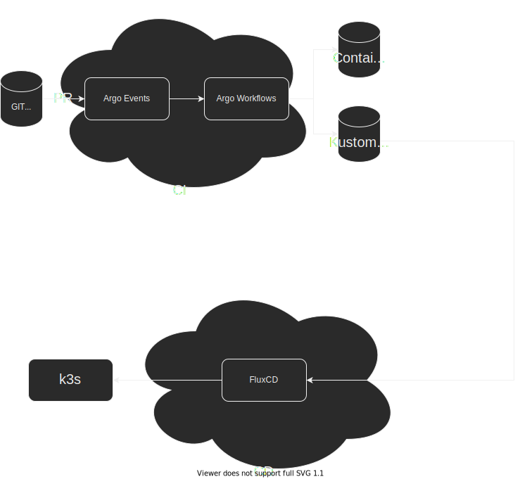

# SRE Live! Choose a CI/CD tool

## Needs
* Build containers
* Execute ansible playbooks
* Deploy to k3s

## Diagram

## Recap

We picked Flux for the CD
We run the get-started tutorial, and it worked!

## Links
* https://toolkit.fluxcd.io/get-started/

## Shortlist
### CI
* ArgoWorkflows (containers)
* Concourse (nice UI! workers based)
* DroneIO (containers)
### CD
* ArgoCD (ecosystem)
* Flux (gitops)
### Others
* Keptn (gating, SLI, declarative pipelines)
* Flagger (Canaries)

